<p align="center"></p>

## Tensorflow - Image Classification

Collection of Tensorflow implementations of Image Classification varieties presented in research papers. Model architectures will not always mirror the ones proposed in the papers, but I have chosen to focus on getting the core ideas covered instead of getting every layer configuration right

## Table of Contents

- [Installation](#installation)
- [Models](#models)
  - [VGG](#vgg)
  - [InceptionNet V1](#inceptionnet-v1)
  - [Inception V3](#inceptionnet-v3)
  - [ResNet V1](#resnet-v1)
  - [RestNet V2](#restnet-v2)
  - [InceptionResNet](#inceptionresnet)
  - [DenseNet](#densenet)
  - [Xception](#xception)
  - [MobileNet V1](#mobilenet-v1)
  - [NASNet](#nasnet)
  - [DPN](#dpn)
  - [ShuffleNet V1](#shufflenet-v1)
  - [MobileNet V2](#mobilenet-v2)
  - [ShuffleNet V2](#shufflenet-v2)
  - [MobileNet V3](#mobilenet-v3)
  - [EfficientNet](#efficientnet)
  - [ConvNeXt](#convnext)
  - [GhostNet](#ghostnet)
  - [ConvMixer](#convmixer)

## Installation
```
git clone https://github.com/tinh2044/ImageClassification-TF.git
cd ./ImageClassification-TF
pip install -r requirements.txt
```

## Models

### VGG

_VERY DEEP CONVOLUTIONAL NETWORKS FOR LARGE-SCALE IMAGE RECOGNITION_

<p align="center">
    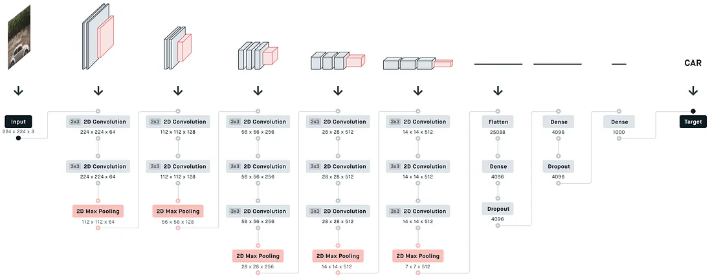
</p>

#### Authors

Karen Simonyan, Andrew Zisserman

#### Abstract

n this work we investigate the effect of the convolutional network depth on its accuracy in the large-scale image recognition setting. Our main contribution is a thorough evaluation of networks of increasing depth using an architecture with very small (3x3) convolution filters, which shows that a significant improvement on the prior-art configurations can be achieved by pushing the depth to 16-19 weight layers. These findings were the basis of our ImageNet Challenge 2014 submission, where our team secured the first and the second places in the localisation and classification tracks respectively. We also show that our representations generalise well to other datasets, where they achieve state-of-the-art results. We have made our two best-performing ConvNet models publicly available to facilitate further research on the use of deep visual representations in computer vision.
[[Paper]](https://arxiv.org/abs/1409.1556) [[Code]](/models/VGG.py)

#### Run Example

```
 python train.py --model_name VGG16 --img_size 224
```

### InceptionNet V1

_Going deeper with convolutions_

<p align="center">
    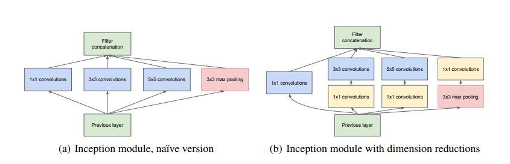
</p>

#### Authors

Christian Szegedy, Wei Liu, Yangqing Jia, Pierre Sermanet, Scott Reed, Dragomir Anguelov, Dumitru Erhan, Vincent Vanhoucke
, Andrew Rabinovich

#### Abstract

We propose a deep convolutional neural network architecture codenamed "Inception", which was responsible for setting the new state of the art for classification and detection in the ImageNet Large-Scale Visual Recognition Challenge 2014 (ILSVRC 2014). The main hallmark of this architecture is the improved utilization of the computing resources inside the network. This was achieved by a carefully crafted design that allows for increasing the depth and width of the network while keeping the computational budget constant. To optimize quality, the architectural decisions were based on the Hebbian principle and the intuition of multi-scale processing. One particular incarnation used in our submission for ILSVRC 2014 is called GoogLeNet, a 22 layers deep network, the quality of which is assessed in the context of classification and detection.

[[Paper]](https://arxiv.org/abs/1409.4842) [[Code]](/models/inceptionNet/inceptionNet_v1.py)

#### Run Example

```
 python train.py --model_name InceptionNetV1 --img_size 224
```

### InceptionNet V3

_Rethinking the Inception Architecture for Computer Vision_

<p align="center">
    
</p>

#### Authors

Christian Szegedy, Vincent Vanhoucke, Sergey Ioffe, Jonathon Shlens, Zbigniew Wojna

#### Abstract

Convolutional networks are at the core of most state-of-the-art computer vision solutions for a wide variety of tasks. Since 2014 very deep convolutional networks started to become mainstream, yielding substantial gains in various benchmarks. Although increased model size and computational cost tend to translate to immediate quality gains for most tasks (as long as enough labeled data is provided for training), computational efficiency and low parameter count are still enabling factors for various use cases such as mobile vision and big-data scenarios. Here we explore ways to scale up networks in ways that aim at utilizing the added computation as efficiently as possible by suitably factorized convolutions and aggressive regularization. We benchmark our methods on the ILSVRC 2012 classification challenge validation set demonstrate substantial gains over the state of the art: 21.2% top-1 and 5.6% top-5 error for single frame evaluation using a network with a computational cost of 5 billion multiply-adds per inference and with using less than 25 million parameters. With an ensemble of 4 models and multi-crop evaluation, we report 3.5% top-5 error on the validation set (3.6% error on the test set) and 17.3% top-1 error on the validation set.

[[Paper]](https://arxiv.org/abs/1512.00567) [[Code]](/models/inceptionNet/inceptionNet_v3.py)

#### Run Example

```
 python train.py  --model_name InceptionNetV3 --img_size 299
```

### ResNet V1

_Deep Residual Learning for Image Recognition_

<p align="center">
    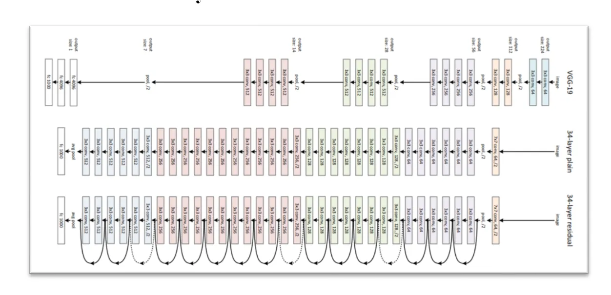
</p>

#### Authors

Kaiming He, Xiangyu Zhang, Shaoqing Ren, Jian Sun

#### Abstract

Deeper neural networks are more difficult to train. We present a residual learning framework to ease the training of networks that are substantially deeper than those used previously. We explicitly reformulate the layers as learning residual functions with reference to the layer inputs, instead of learning unreferenced functions. We provide comprehensive empirical evidence showing that these residual networks are easier to optimize, and can gain accuracy from considerably increased depth. On the ImageNet dataset we evaluate residual nets with a depth of up to 152 layers---8x deeper than VGG nets but still having lower complexity. An ensemble of these residual nets achieves 3.57% error on the ImageNet test set. This result won the 1st place on the ILSVRC 2015 classification task. We also present analysis on CIFAR-10 with 100 and 1000 layers.
The depth of representations is of central importance for many visual recognition tasks. Solely due to our extremely deep representations, we obtain a 28% relative improvement on the COCO object detection dataset. Deep residual nets are foundations of our submissions to ILSVRC & COCO 2015 competitions, where we also won the 1st places on the tasks of ImageNet detection, ImageNet localization, COCO detection, and COCO segmentation.

[[Paper]](https://arxiv.org/abs/1512.03385) [[Code]](/models/resNet/resNetV1.py)

#### Run Example

```
 python train.py --model_name ResNet50  --img_size 224
```

### RestNet V2

_Identity Mappings in Deep Residual Networks_

<p align="center">
    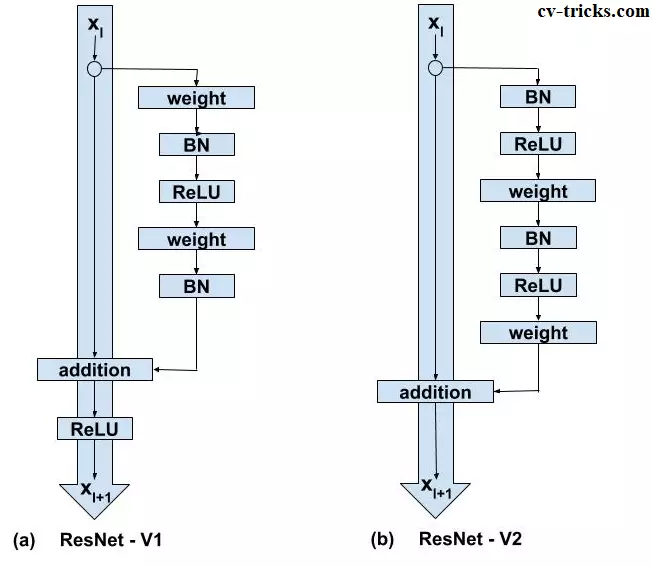
</p>

#### Authors

Kaiming He, Xiangyu Zhang, Shaoqing Ren, Jian Sun

#### Abstract

Deep residual networks have emerged as a family of extremely deep architectures showing compelling accuracy and nice convergence behaviors. In this paper, we analyze the propagation formulations behind the residual building blocks, which suggest that the forward and backward signals can be directly propagated from one block to any other block, when using identity mappings as the skip connections and after-addition activation. A series of ablation experiments support the importance of these identity mappings. This motivates us to propose a new residual unit, which makes training easier and improves generalization. We report improved results using a 1001-layer ResNet on CIFAR-10 (4.62% error) and CIFAR-100, and a 200-layer ResNet on ImageNet.

[[Paper]](https://arxiv.org/abs/1603.05027) [[Code]](/models/resNet/resNetV2.py)

#### Run Example

```
 python train.py --model_name ResNetV2_50  --img_size 224
```

### InceptionResNet

_Inception-v4, Inception-ResNet and the Impact of Residual Connections on Learning_

<p align="center">
    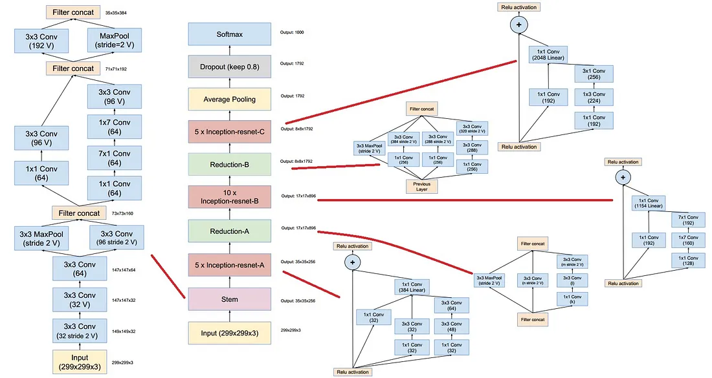
</p>

#### Authors

Christian Szegedy, Sergey Ioffe, Vincent Vanhoucke, Alex Alemi

#### Abstract

Very deep convolutional networks have been central to the largest advances in image recognition performance in recent years. One example is the Inception architecture that has been shown to achieve very good performance at relatively low computational cost. Recently, the introduction of residual connections in conjunction with a more traditional architecture has yielded state-of-the-art performance in the 2015 ILSVRC challenge; its performance was similar to the latest generation Inception-v3 network. This raises the question of whether there are any benefit in combining the Inception architecture with residual connections. Here we give clear empirical evidence that training with residual connections accelerates the training of Inception networks significantly. There is also some evidence of residual Inception networks outperforming similarly expensive Inception networks without residual connections by a thin margin. We also present several new streamlined architectures for both residual and non-residual Inception networks. These variations improve the single-frame recognition performance on the ILSVRC 2012 classification task significantly. We further demonstrate how proper activation scaling stabilizes the training of very wide residual Inception networks. With an ensemble of three residual and one Inception-v4, we achieve 3.08 percent top-5 error on the test set of the ImageNet classification (CLS) challenge

[[Paper]](https://arxiv.org/abs/1602.07261) [[Code]](/models/inceptionResNet)

#### Run Example

```
 python train.py --model_name InceptionResNetV1 --img_size 299
```

### DenseNet

_Densely Connected Convolutional Networks_

<p align="center">
    
</p>

#### Authors

Gao Huang, Zhuang Liu, Laurens van der Maaten, Kilian Q. Weinberger

#### Abstract

Recent work has shown that convolutional networks can be substantially deeper, more accurate, and efficient to train if they contain shorter connections between layers close to the input and those close to the output. In this paper, we embrace this observation and introduce the Dense Convolutional Network (DenseNet), which connects each layer to every other layer in a feed-forward fashion. Whereas traditional convolutional networks with L layers have L connections - one between each layer and its subsequent layer - our network has L(L+1)/2 direct connections. For each layer, the feature-maps of all preceding layers are used as inputs, and its own feature-maps are used as inputs into all subsequent layers. DenseNets have several compelling advantages: they alleviate the vanishing-gradient problem, strengthen feature propagation, encourage feature reuse, and substantially reduce the number of parameters. We evaluate our proposed architecture on four highly competitive object recognition benchmark tasks (CIFAR-10, CIFAR-100, SVHN, and ImageNet). DenseNets obtain significant improvements over the state-of-the-art on most of them, whilst requiring less computation to achieve high performance.

[[Paper]](https://arxiv.org/abs/1608.06993) [[Code]](/models/denseNet)

#### Run Example

```
 python train.py --model_name DenseNet121 --img_size 224
```

### Xception

_Xception: Deep Learning with Depthwise Separable Convolutions_

<p align="center">
    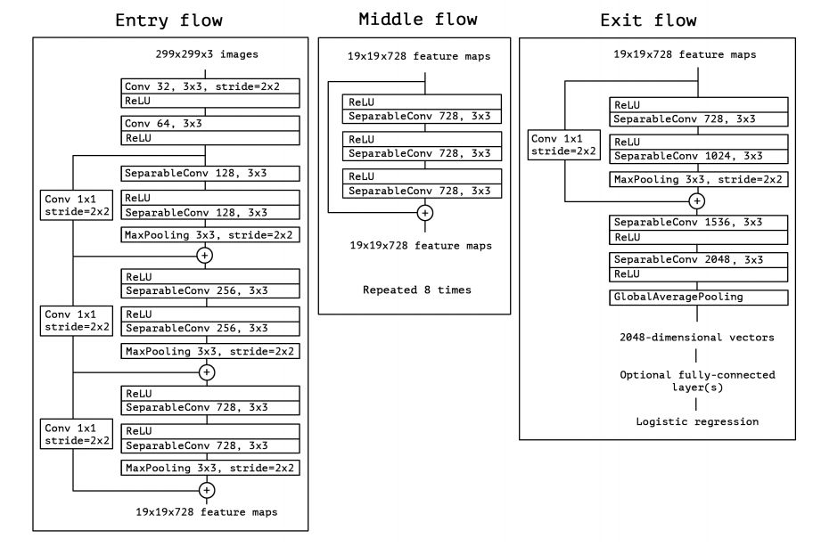
</p>

#### Authors

François Chollet

#### Abstract

We present an interpretation of Inception modules in convolutional neural networks as being an intermediate step in-between regular convolution and the depthwise separable convolution operation (a depthwise convolution followed by a pointwise convolution). In this light, a depthwise separable convolution can be understood as an Inception module with a maximally large number of towers. This observation leads us to propose a novel deep convolutional neural network architecture inspired by Inception, where Inception modules have been replaced with depthwise separable convolutions. We show that this architecture, dubbed Xception, slightly outperforms Inception V3 on the ImageNet dataset (which Inception V3 was designed for), and significantly outperforms Inception V3 on a larger image classification dataset comprising 350 million images and 17,000 classes. Since the Xception architecture has the same number of parameters as Inception V3, the performance gains are not due to increased capacity but rather to a more efficient use of model parameters.

[[Paper]](https://arxiv.org/abs/1610.02357) [[Code]](/models/xception/xception.py)

#### Run Example

```
 python train.py --model_name Xception --img_size 299
```

### MobileNet V1

_MobileNets: Efficient Convolutional Neural Networks for Mobile Vision Applications_

<p align="center">
    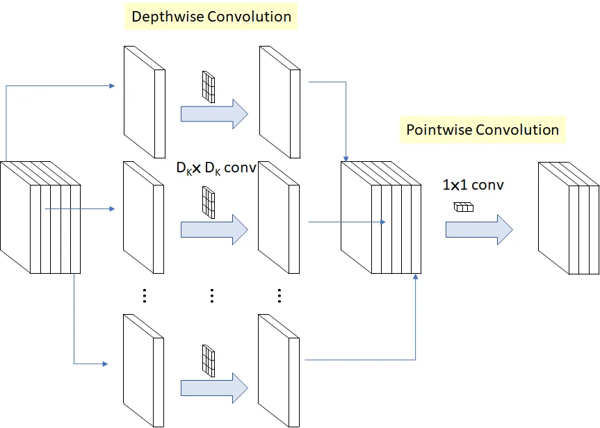
</p>

#### Authors

Andrew G. Howard, Menglong Zhu, Bo Chen, Dmitry Kalenichenko, Weijun Wang, Tobias Weyand, Marco Andreetto, Hartwig Adam

#### Abstract

We present a class of efficient models called MobileNets for mobile and embedded vision applications. MobileNets are based on a streamlined architecture that uses depth-wise separable convolutions to build light weight deep neural networks. We introduce two simple global hyper-parameters that efficiently trade off between latency and accuracy. These hyper-parameters allow the model builder to choose the right sized model for their application based on the constraints of the problem. We present extensive experiments on resource and accuracy tradeoffs and show strong performance compared to other popular models on ImageNet classification. We then demonstrate the effectiveness of MobileNets across a wide range of applications and use cases including object detection, finegrain classification, face attributes and large scale geo-localization.

[[Paper]](https://arxiv.org/abs/1704.04861) [[Code]](/models/mobileNet/mobileNet_v1.py)

#### Run Example

```
 python train.py --model_name MobileNetV1 --img_size 224
```

### NASNet

_Learning Transferable Architectures for Scalable Image Recognition_

<p align="center">
    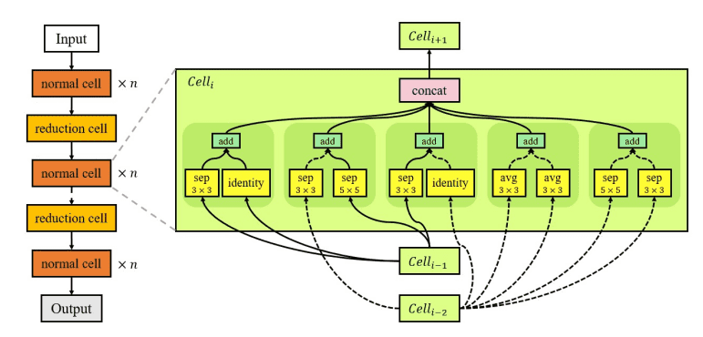
</p>

#### Authors

Barret Zoph, Vijay Vasudevan, Jonathon Shlens, Quoc V. Le

#### Abstract

Developing neural network image classification models often requires significant architecture engineering. In this paper, we study a method to learn the model architectures directly on the dataset of interest. As this approach is expensive when the dataset is large, we propose to search for an architectural building block on a small dataset and then transfer the block to a larger dataset. The key contribution of this work is the design of a new search space (the "NASNet search space") which enables transferability. In our experiments, we search for the best convolutional layer (or "cell") on the CIFAR-10 dataset and then apply this cell to the ImageNet dataset by stacking together more copies of this cell, each with their own parameters to design a convolutional architecture, named "NASNet architecture". We also introduce a new regularization technique called ScheduledDropPath that significantly improves generalization in the NASNet models. On CIFAR-10 itself, NASNet achieves 2.4% error rate, which is state-of-the-art. On ImageNet, NASNet achieves, among the published works, state-of-the-art accuracy of 82.7% top-1 and 96.2% top-5 on ImageNet. Our model is 1.2% better in top-1 accuracy than the best human-invented architectures while having 9 billion fewer FLOPS - a reduction of 28% in computational demand from the previous state-of-the-art model. When evaluated at different levels of computational cost, accuracies of NASNets exceed those of the state-of-the-art human-designed models. For instance, a small version of NASNet also achieves 74% top-1 accuracy, which is 3.1% better than equivalently-sized, state-of-the-art models for mobile platforms. Finally, the learned features by NASNet used with the Faster-RCNN framework surpass state-of-the-art by 4.0% achieving 43.1% mAP on the COCO dataset.

[[Paper]](https://www.arxiv.org/abs/1707.07012) [[Code]](/models/nasNet)

#### Run Example

```
 python train.py --model_name NASNetMobile --img_size 224
```

### DPN

_Dual Path Networks_

<p align="center">
    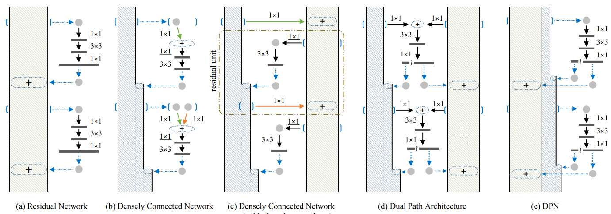
</p>

#### Authors

Yunpeng Chen, Jianan Li, Huaxin Xiao, Xiaojie Jin, Shuicheng Yan, Jiashi Feng

#### Abstract

In this work, we present a simple, highly efficient and modularized Dual Path Network (DPN) for image classification which presents a new topology of connection paths internally. By revealing the equivalence of the state-of-the-art Residual Network (ResNet) and Densely Convolutional Network (DenseNet) within the HORNN framework, we find that ResNet enables feature re-usage while DenseNet enables new features exploration which are both important for learning good representations. To enjoy the benefits from both path topologies, our proposed Dual Path Network shares common features while maintaining the flexibility to explore new features through dual path architectures. Extensive experiments on three benchmark datasets, ImagNet-1k, Places365 and PASCAL VOC, clearly demonstrate superior performance of the proposed DPN over state-of-the-arts. In particular, on the ImagNet-1k dataset, a shallow DPN surpasses the best ResNeXt-101(64x4d) with 26% smaller model size, 25% less computational cost and 8% lower memory consumption, and a deeper DPN (DPN-131) further pushes the state-of-the-art single model performance with about 2 times faster training speed. Experiments on the Places365 large-scale scene dataset, PASCAL VOC detection dataset, and PASCAL VOC segmentation dataset also demonstrate its consistently better performance than DenseNet, ResNet and the latest ResNeXt model over various applications.

[[Paper]](https://arxiv.org/abs/1707.01629) [[Code]](/models/DPN)

#### Run Example

```
 python train.py --model_name DPN92 --img_size 224
```

### ShuffleNet V1

_ShuffleNet: An Extremely Efficient Convolutional Neural Network for Mobile Devices_

<p align="center">
    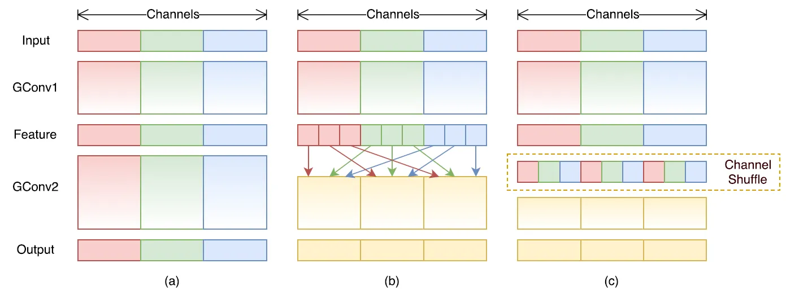
</p>

#### Authors

Xiangyu Zhang, Xinyu Zhou, Mengxiao Lin, Jian Sun

#### Abstract

We introduce an extremely computation-efficient CNN architecture named ShuffleNet, which is designed specially for mobile devices with very limited computing power (e.g., 10-150 MFLOPs). The new architecture utilizes two new operations, pointwise group convolution and channel shuffle, to greatly reduce computation cost while maintaining accuracy. Experiments on ImageNet classification and MS COCO object detection demonstrate the superior performance of ShuffleNet over other structures, e.g. lower top-1 error (absolute 7.8%) than recent MobileNet on ImageNet classification task, under the computation budget of 40 MFLOPs. On an ARM-based mobile device, ShuffleNet achieves ~13x actual speedup over AlexNet while maintaining comparable accuracy.

[[Paper]](https://arxiv.org/abs/1707.01083) [[Code]](/models/shuffleNet/shuffleNetV1.py)

#### Run Example

```
 python train.py --model_name ShuffleNetV1_1_0x --img_size 224
```

### MobileNet V2

_MobileNetV2: Inverted Residuals and Linear Bottlenecks_

<p align="center">
    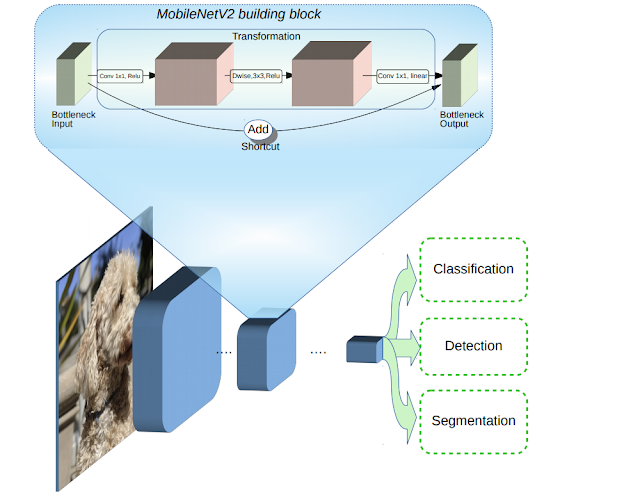
</p>

#### Authors

Mark Sandler, Andrew Howard, Menglong Zhu, Andrey Zhmoginov, Liang-Chieh Chen

#### Abstract

In this paper we describe a new mobile architecture, MobileNetV2, that improves the state of the art performance of mobile models on multiple tasks and benchmarks as well as across a spectrum of different model sizes. We also describe efficient ways of applying these mobile models to object detection in a novel framework we call SSDLite. Additionally, we demonstrate how to build mobile semantic segmentation models through a reduced form of DeepLabv3 which we call Mobile DeepLabv3.
The MobileNetV2 architecture is based on an inverted residual structure where the input and output of the residual block are thin bottleneck layers opposite to traditional residual models which use expanded representations in the input an MobileNetV2 uses lightweight depthwise convolutions to filter features in the intermediate expansion layer. Additionally, we find that it is important to remove non-linearities in the narrow layers in order to maintain representational power. We demonstrate that this improves performance and provide an intuition that led to this design. Finally, our approach allows decoupling of the input/output domains from the expressiveness of the transformation, which provides a convenient framework for further analysis. We measure our performance on Imagenet classification, COCO object detection, VOC image segmentation. We evaluate the trade-offs between accuracy, and number of operations measured by multiply-adds (MAdd), as well as the number of parameters

[[Paper]](https://arxiv.org/abs/1801.04381) [[Code]](/models/mobileNet/mobileNet_v2.py)

#### Run Example

```
 python train.py --model_name MobileNetV2 --img_size 224
```

### ShuffleNet V2

_ShuffleNet V2: Practical Guidelines for Efficient CNN Architecture Design_

<p align="center">
    
</p>

#### Authors

Ningning Ma, Xiangyu Zhang, Hai-Tao Zheng, Jian Sun

#### Abstract

Currently, the neural network architecture design is mostly guided by the \emph{indirect} metric of computation complexity, i.e., FLOPs. However, the \emph{direct} metric, e.g., speed, also depends on the other factors such as memory access cost and platform characterics. Thus, this work proposes to evaluate the direct metric on the target platform, beyond only considering FLOPs. Based on a series of controlled experiments, this work derives several practical \emph{guidelines} for efficient network design. Accordingly, a new architecture is presented, called \emph{ShuffleNet V2}. Comprehensive ablation experiments verify that our model is the state-of-the-art in terms of speed and accuracy tradeoff.

[[Paper]](https://arxiv.org/abs/1807.11164) [[Code]](/models/shuffleNet/shuffleNetV2.py)

#### Run Example

```
 python train.py --model_name ShuffleNetV2_1_0x --img_size 224
```

### MobileNet V3

_Searching for MobileNetV3_

<p align="center">
    
</p>

#### Authors

Andrew Howard, Mark Sandler, Grace Chu, Liang-Chieh Chen, Bo Chen, Mingxing Tan, Weijun Wang, Yukun Zhu, Ruoming Pang, Vijay Vasudevan, Quoc V. Le, Hartwig Adam

#### Abstract

We present the next generation of MobileNets based on a combination of complementary search techniques as well as a novel architecture design. MobileNetV3 is tuned to mobile phone CPUs through a combination of hardware-aware network architecture search (NAS) complemented by the NetAdapt algorithm and then subsequently improved through novel architecture advances. This paper starts the exploration of how automated search algorithms and network design can work together to harness complementary approaches improving the overall state of the art. Through this process we create two new MobileNet models for release: MobileNetV3-Large and MobileNetV3-Small which are targeted for high and low resource use cases. These models are then adapted and applied to the tasks of object detection and semantic segmentation. For the task of semantic segmentation (or any dense pixel prediction), we propose a new efficient segmentation decoder Lite Reduced Atrous Spatial Pyramid Pooling (LR-ASPP). We achieve new state of the art results for mobile classification, detection and segmentation. MobileNetV3-Large is 3.2\% more accurate on ImageNet classification while reducing latency by 15\% compared to MobileNetV2. MobileNetV3-Small is 4.6\% more accurate while reducing latency by 5\% compared to MobileNetV2. MobileNetV3-Large detection is 25\% faster at roughly the same accuracy as MobileNetV2 on COCO detection. MobileNetV3-Large LR-ASPP is 30\% faster than MobileNetV2 R-ASPP at similar accuracy for Cityscapes segmentation.

[[Paper]](https://arxiv.org/abs/1905.02244) [[Code]](/models/mobileNet/mobileNet_v3.py)

#### Run Example

```
 python train.py --model_name MobileNetV3Small --img_size 224
```

### EfficientNet

_EfficientNet: Rethinking Model Scaling for Convolutional Neural Networks_

<p align="center">
    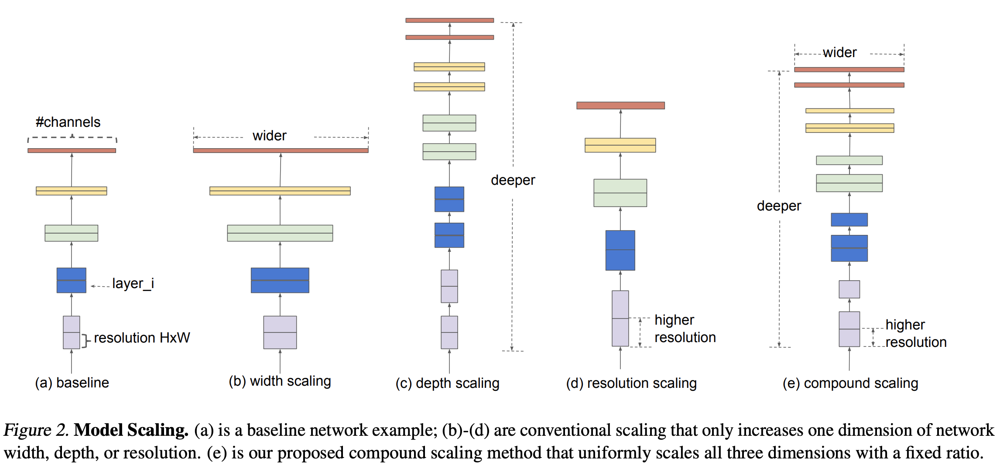
</p>

#### Authors

Mingxing Tan, Quoc V. Le

#### Abstract

Convolutional Neural Networks (ConvNets) are commonly developed at a fixed resource budget, and then scaled up for better accuracy if more resources are available. In this paper, we systematically study model scaling and identify that carefully balancing network depth, width, and resolution can lead to better performance. Based on this observation, we propose a new scaling method that uniformly scales all dimensions of depth/width/resolution using a simple yet highly effective compound coefficient. We demonstrate the effectiveness of this method on scaling up MobileNets and ResNet.
To go even further, we use neural architecture search to design a new baseline network and scale it up to obtain a family of models, called EfficientNets, which achieve much better accuracy and efficiency than previous ConvNets. In particular, our EfficientNet-B7 achieves state-of-the-art 84.3% top-1 accuracy on ImageNet, while being 8.4x smaller and 6.1x faster on inference than the best existing ConvNet. Our EfficientNets also transfer well and achieve state-of-the-art accuracy on CIFAR-100 (91.7%), Flowers (98.8%), and 3 other transfer learning datasets, with an order of magnitude fewer parameters.

[[Paper]](https://arxiv.org/abs/1905.11946) [[Code]](/models/efficientNet)

#### Run Example

```
 python train.py --model_name EfficientNetB0 --img_size 224
```

### ConvNeXt

_A ConvNet for the 2020s_

<p align="center">
    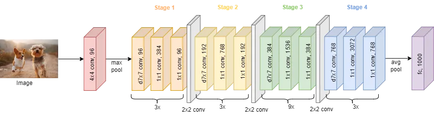
</p>

#### Authors

Zhuang Liu, Hanzi Mao, Chao-Yuan Wu, Christoph Feichtenhofer, Trevor Darrell, Saining Xie

#### Abstract

The "Roaring 20s" of visual recognition began with the introduction of Vision Transformers (ViTs), which quickly superseded ConvNets as the state-of-the-art image classification model. A vanilla ViT, on the other hand, faces difficulties when applied to general computer vision tasks such as object detection and semantic segmentation. It is the hierarchical Transformers (e.g., Swin Transformers) that reintroduced several ConvNet priors, making Transformers practically viable as a generic vision backbone and demonstrating remarkable performance on a wide variety of vision tasks. However, the effectiveness of such hybrid approaches is still largely credited to the intrinsic superiority of Transformers, rather than the inherent inductive biases of convolutions. In this work, we reexamine the design spaces and test the limits of what a pure ConvNet can achieve. We gradually "modernize" a standard ResNet toward the design of a vision Transformer, and discover several key components that contribute to the performance difference along the way. The outcome of this exploration is a family of pure ConvNet models dubbed ConvNeXt. Constructed entirely from standard ConvNet modules, ConvNeXts compete favorably with Transformers in terms of accuracy and scalability, achieving 87.8% ImageNet top-1 accuracy and outperforming Swin Transformers on COCO detection and ADE20K segmentation, while maintaining the simplicity and efficiency of standard ConvNets.

[[Paper]](https://arxiv.org/abs/2201.03545) [[Code]](/models/convNeXt)

#### Run Example

```
 python train.py --model_name ConvNeXtSmall --img_size 224
```

### GhostNet

_GhostNet: More Features from Cheap Operations_

<p align="center">
    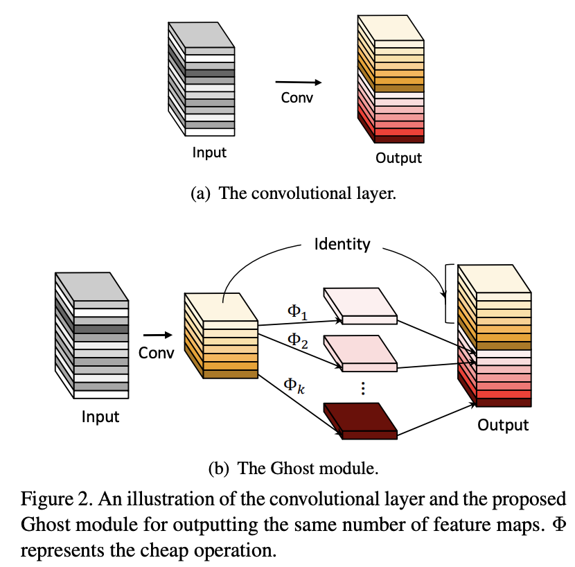
</p>

#### Authors

Kai Han, Yunhe Wang, Qi Tian, Jianyuan Guo, Chunjing Xu, Chang Xu

#### Abstract

Deploying convolutional neural networks (CNNs) on embedded devices is difficult due to the limited memory and computation resources. The redundancy in feature maps is an important characteristic of those successful CNNs, but has rarely been investigated in neural architecture design. This paper proposes a novel Ghost module to generate more feature maps from cheap operations. Based on a set of intrinsic feature maps, we apply a series of linear transformations with cheap cost to generate many ghost feature maps that could fully reveal information underlying intrinsic features. The proposed Ghost module can be taken as a plug-and-play component to upgrade existing convolutional neural networks. Ghost bottlenecks are designed to stack Ghost modules, and then the lightweight GhostNet can be easily established. Experiments conducted on benchmarks demonstrate that the proposed Ghost module is an impressive alternative of convolution layers in baseline models, and our GhostNet can achieve higher recognition performance (e.g. 75.7% top-1 accuracy) than MobileNetV3 with similar computational cost on the ImageNet ILSVRC-2012 classification dataset.

[[Paper]](https://arxiv.org/abs/1911.11907) [[Code]](/models/ghostNet)

#### Run Example

```
 python train.py --model_name GhostNet --img_size 224
```

### ConvMixer

_Patches Are All You Need?_

<p align="center">
    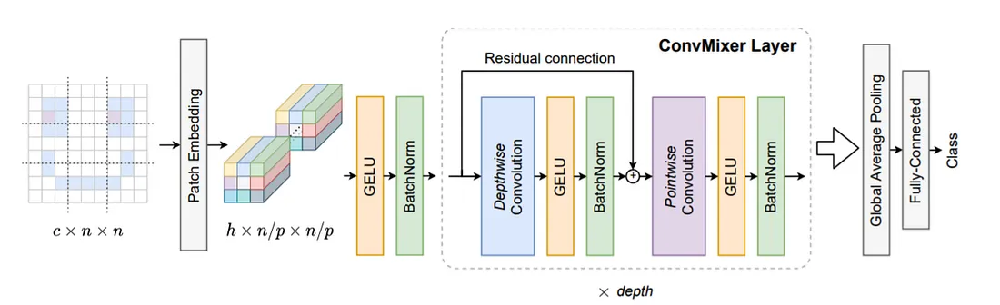
</p>

#### Authors

Asher Trockman, J. Zico Kolter

#### Abstract

Although convolutional networks have been the dominant architecture for vision tasks for many years, recent experiments have shown that Transformer-based models, most notably the Vision Transformer (ViT), may exceed their performance in some settings. However, due to the quadratic runtime of the self-attention layers in Transformers, ViTs require the use of patch embeddings, which group together small regions of the image into single input features, in order to be applied to larger image sizes. This raises a question: Is the performance of ViTs due to the inherently-more-powerful Transformer architecture, or is it at least partly due to using patches as the input representation? In this paper, we present some evidence for the latter: specifically, we propose the ConvMixer, an extremely simple model that is similar in spirit to the ViT and the even-more-basic MLP-Mixer in that it operates directly on patches as input, separates the mixing of spatial and channel dimensions, and maintains equal size and resolution throughout the network. In contrast, however, the ConvMixer uses only standard convolutions to achieve the mixing steps. Despite its simplicity, we show that the ConvMixer outperforms the ViT, MLP-Mixer, and some of their variants for similar parameter counts and data set sizes, in addition to outperforming classical vision models such as the ResNet.

[[Paper]](https://arxiv.org/abs/2201.09792) [[Code]](/models/convMixer)

#### Run Example

```
 python train.py --model_name ConvMixer --img_size 224
```


